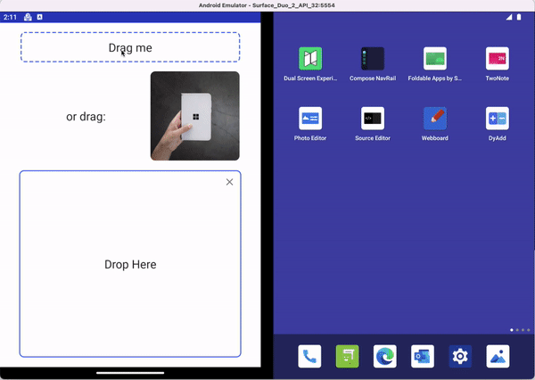
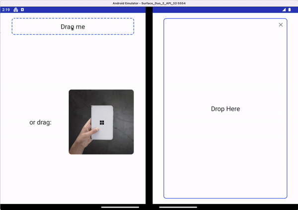

# Drag and drop - Surface Duo Compose SDK

**DragAndDrop** is a component for Jetpack Compose that helps you easily add interactive drag and drop capabilities to your app, following Google [Drag and drop](https://developer.android.com/guide/topics/ui/drag-drop) guideline. With the drag and drop feature, dual-screen and foldable devices can be leveraged to share information in between easily.

The component provides a drag container which represents the draggable area with long press gesture. The drag target wraps the drag data providing a shadow during the dragging process. Currently it supports image and text in Mimetype. A drop container provides a dropping area to handle the detected drag data.

## Add to your project

1. Make sure you have **mavenCentral()** repository in your top level **build.gradle** file:

    ```gradle
    allprojects {
        repositories {
            google()
            mavenCentral()
         }
    }
    ```

2. Add dependencies to the module-level **build.gradle** file (current version may be different from what's shown here).

    ```gradle
    implementation "com.microsoft.device.dualscreen:draganddrop:1.0.0-alpha01"
    ```

3. Also ensure the compileSdkVersion and targetSdkVersion are set to API 31 or newer in the module-level build.gradle file.

    ```gradle
    android { 
        compileSdkVersion 31
        
        defaultConfig { 
            targetSdkVersion 31
        } 
        ... 
    }
    ```

4. Build the drag and drop feature with **DragAndDrop**. Please refer to the [sample](https://github.com/microsoft/surface-duo-compose-sdk/tree/main/DragAndDrop/sample) for more details.

## API reference

The sections below describe how to use DragAndDrop component to build the feature. Please refer to the [Drag and drop documentation](https://docs.microsoft.com/dual-screen/android/jetpack/compose) for more details.

### Drag and drop process

1. Wrapping your `Composable` with `DragContainer` to define a draggable area, where the drag and drop happens.

```kotlin
@Composable
fun DragContainer(
    modifier: Modifier = Modifier,
    content: @Composable BoxScope.() -> Unit
)
```

2. Create `DragData` to represent the data to share with the metadata, including `MimeType`.

```kotlin
class DragData(
    val type: MimeType = MimeType.TEXT_PLAIN,
    val data: Any? = null
)
```

```kotlin
enum class MimeType(val value: String) {
    IMAGE_JPEG("image/jpeg"),
    TEXT_PLAIN("text/plain"),
    UNKNOWN_TYPE("unknown")
}
```

3. Initialize a `DragTarget` with the created `DragData` and the `Composable` which would respond to the user's drag gesture by long pressing. A shadow will be created for the target during the dragging process.

```kotlin
@Composable
fun DragTarget(
    dragData: DragData,
    content: @Composable (() -> Unit)
)
```

4. Specify a `Composable` to handle the dropping event using `DropContainer`. The lambda `onDrag` will let you know whether the dragging gesture goes within the dropping area and the gesture finishes.

```kotlin
@Composable
fun DropContainer(
    modifier: Modifier,
    onDrag: (inBounds: Boolean, isDragging: Boolean) -> Unit,
    content: @Composable (BoxScope.(data: DragData?) -> Unit)
)
```

## Sample behavior

The following screenshots from the [sample](https://github.com/microsoft/surface-duo-compose-sdk/tree/main/DragAndDrop/sample) shows the drag and drop feature inside a single-screen and across both screens.





## Contributing

This project welcomes contributions and suggestions.  Most contributions require you to agree to a
Contributor License Agreement (CLA) declaring that you have the right to, and actually do, grant us
the rights to use your contribution. For details, visit https://cla.opensource.microsoft.com.

When you submit a pull request, a CLA bot will automatically determine whether you need to provide
a CLA and decorate the PR appropriately (e.g., status check, comment). Simply follow the instructions
provided by the bot. You will only need to do this once across all repos using our CLA.

This project has adopted the [Microsoft Open Source Code of Conduct](https://opensource.microsoft.com/codeofconduct/).
For more information see the [Code of Conduct FAQ](https://opensource.microsoft.com/codeofconduct/faq/) or
contact [opencode@microsoft.com](mailto:opencode@microsoft.com) with any additional questions or comments.

## License

Copyright (c) Microsoft Corporation.

MIT License

Permission is hereby granted, free of charge, to any person obtaining a copy of this software and associated documentation files (the "Software"), to deal in the Software without restriction, including without limitation the rights to use, copy, modify, merge, publish, distribute, sublicense, and/or sell copies of the Software, and to permit persons to whom the Software is furnished to do so, subject to the following conditions:

The above copyright notice and this permission notice shall be included in all copies or substantial portions of the Software.

THE SOFTWARE IS PROVIDED AS IS, WITHOUT WARRANTY OF ANY KIND, EXPRESS OR IMPLIED, INCLUDING BUT NOT LIMITED TO THE WARRANTIES OF MERCHANTABILITY, FITNESS FOR A PARTICULAR PURPOSE AND NONINFRINGEMENT. IN NO EVENT SHALL THE AUTHORS OR COPYRIGHT HOLDERS BE LIABLE FOR ANY CLAIM, DAMAGES OR OTHER LIABILITY, WHETHER IN AN ACTION OF CONTRACT, TORT OR OTHERWISE, ARISING FROM, OUT OF OR IN CONNECTION WITH THE SOFTWARE OR THE USE OR OTHER DEALINGS IN THE SOFTWARE.
