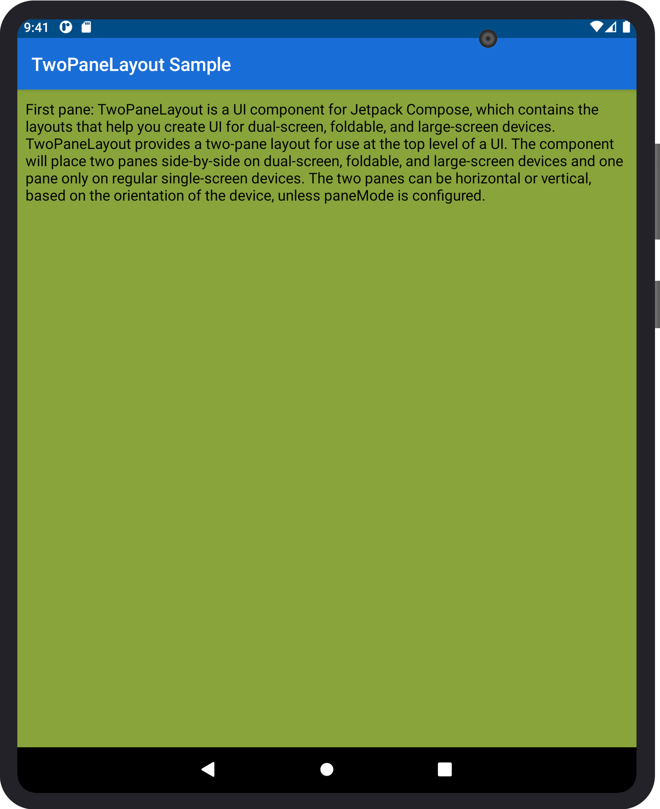
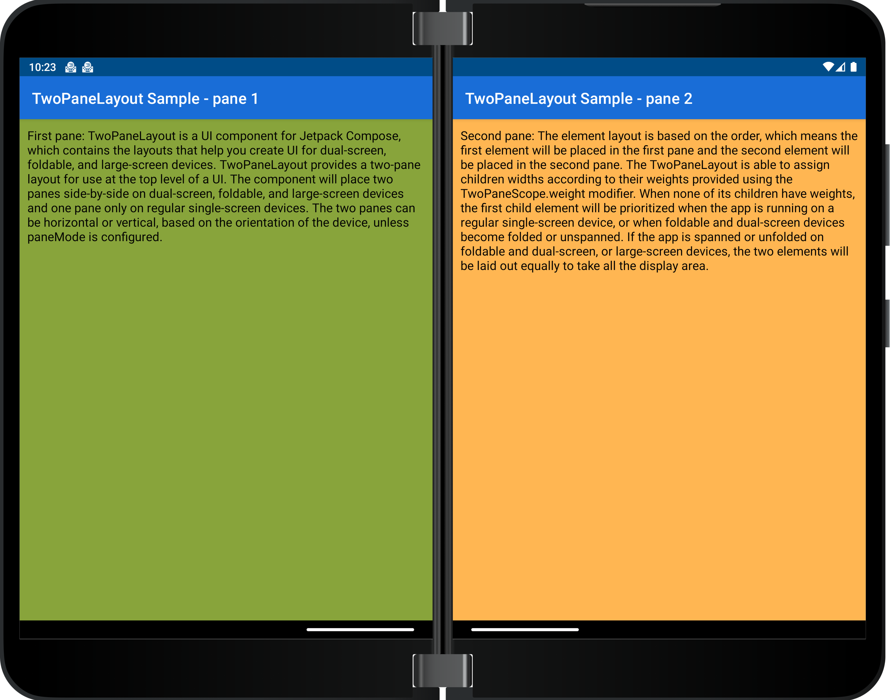

# TwoPaneLayout - Surface Duo Compose SDK

**TwoPaneLayout** is a Jetpack Compose component that helps you create UI for dual-screen, foldable, and large-screen devices. TwoPaneLayout provides a two-pane layout for use at the top level of a UI. The component will place two panes side-by-side when the app is spanned on dual-screen, foldable and large-screen devices. These panes can be horizontal or vertical, depending on the orientation of the device and the selected `paneMode`.

When the app is spanned across a separating vertical hinge or fold, or when the width is larger than height of the screen on a large-screen device, pane 1 will be placed on the left, while pane 2 will be on the right. If the device rotates, the app is spanned across a separating horizontal hinge or fold, or the width is smaller than the height of screen on large-screen device, pane 1 will be placed on the top and pane 2 will be on the bottom.

## Add to your project

1. Make sure you have `mavenCentral()` repository in your top level **build.gradle** file:

    ```gradle
    allprojects {
        repositories {
            google()
            mavenCentral()
         }
    }
    ```

2. Add dependencies to the module-level **build.gradle** file (current version may be different from what's shown here).

    ```gradle
    implementation "com.microsoft.device.dualscreen:twopanelayout:1.0.1-alpha01"
    ```

3. Also ensure the compileSdkVersion and targetSdkVersion are set to API 31 or newer in the module-level **build.gradle** file.

    ```gradle
    android { 
        compileSdkVersion 31
        
        defaultConfig { 
            targetSdkVersion 31
        } 
        ... 
    }
    ```

4. Build layout with **TwoPaneLayout** or **TwoPaneLayoutNav**. Please refer to the [sample](https://github.com/microsoft/surface-duo-compose-sdk/tree/main/TwoPaneLayout/sample) and [nav sample](https://github.com/microsoft/surface-duo-compose-sdk/tree/main/TwoPaneLayout/nav_sample) for more details.

## API reference

The sections below describe how to use and customize TwoPaneLayout for different scenarios. Please refer to the [TwoPaneLayout documentation](https://docs.microsoft.com/dual-screen/android/jetpack/compose/two-pane-layout) for more details.

To learn more about common use cases for two-pane layouts, please check out the [dual-screen user interface patterns](https://docs.microsoft.com/dual-screen/introduction#dual-screen-app-patterns).

### TwoPaneLayout

The main TwoPaneLayout constructors both accept parameters for a modifier, [pane mode](#pane-mode), and content to show in pane 1 and pane 2. The second constructor also accepts a `NavHostController` parameter, which is useful for accessing navigation information in your app.

```kotlin
@Composable
fun TwoPaneLayout(
    modifier: Modifier = Modifier,
    paneMode: TwoPaneMode = TwoPaneMode.TwoPane,
    pane1: @Composable TwoPaneScope.() -> Unit,
    pane2: @Composable TwoPaneScope.() -> Unit
)

@Composable
fun TwoPaneLayout(
    modifier: Modifier = Modifier,
    paneMode: TwoPaneMode = TwoPaneMode.TwoPane,
    navController: NavHostController,
    pane1: @Composable TwoPaneScope.() -> Unit,
    pane2: @Composable TwoPaneScope.() -> Unit
)
```

The content shown in each pane can access methods from the `TwoPaneScope` interface:

```kotlin
interface TwoPaneScope {

    fun Modifier.weight(weight: Float): Modifier

    fun navigateToPane1()

    fun navigateToPane2()

    val currentSinglePaneDestination: String

    val isSinglePane: Boolean
}
```

The [weight modifier](#weight-modifier) is described in more detail below.

### Pane mode

The pane mode affects when two panes are shown for TwoPaneLayout. By default, whenever there is a separating fold or a large screen, two panes will be shown, but you can choose to show only one pane in these cases by changing the pane mode.

```kotlin
enum class TwoPaneMode {
    TwoPane,
    HorizontalSingle,
    VerticalSingle
}
```

There are three pane modes available for TwoPaneLayout:

- `TwoPane` - default mode, always shows two panes regardless of the orientation
- `HorizontalSingle` - shows one big pane when in the horizontal orientation (combines top/bottom panes)
    
- `VerticalSingle` - shows one big pane when in the vertical orientation (combines left/right panes)
    

### Weight modifier

TwoPaneLayout is able to assign children widths or heights according to their weights provided using the `TwoPaneScope.weight` and `TwoPaneNavScope.weight` modifiers. This only effects the layout for large screen and foldable devices, but for single-screen devices, there will still only be one pane visible, regardless of the weight.

```kotlin
fun Modifier.weight(weight: Float): Modifier
```

For large screens:

- No weight &rarr; two panes displayed equally
- Weight &rarr; layout split up proportionally according to the weight
    

For foldables:

- Separating fold &rarr; layout split up according to fold boundaries (with or without weight)
    
    
- Non-separating fold &rarr; device treated as a large screen or single-screen depending on its size

## TwoPaneLayoutNav

The TwoPaneLayoutNav constructor can be used for more complicated navigation scenarios. It accepts parameters for a modifier, pane mode, `NavHostController`, content for multiple app destinations, and start destinations.

```kotlin
@Composable
fun TwoPaneLayoutNav(
    modifier: Modifier = Modifier,
    navController: NavHostController,
    paneMode: TwoPaneMode = TwoPaneMode.TwoPane,
    destinations: Array<Destination>,
    singlePaneStartDestination: String,
    pane1StartDestination: String,
    pane2StartDestination: String
) 
```

Like destinations in a `NavHost`, each destination in TwoPaneLayoutNav has a route and composable content.

```kotlin
data class Destination(val route: String, val content: @Composable TwoPaneNavScope.() -> Unit)
```

The content shown in each destination can access methods from the `TwoPaneNavScope` interface:

```kotlin
interface TwoPaneNavScope {

    fun Modifier.weight(weight: Float): Modifier

    fun NavHostController.navigateTo(
        route: String,
        screen: Screen,
        navOptions: NavOptionsBuilder.() -> Unit = { },
    )

    val currentSinglePaneDestination: String

    val currentPane1Destination: String

    val currentPane2Destination: String

    val isSinglePane: Boolean
}
```

The `navigateTo` method is an enhanced version of the `navigate` method from `NavHostController` that works when one or two panes are shown. The `screen` parameter determines which pane, or screen, a destination should be shown in when in two pane mode: `Screen.Pane1` or `Screen.Pane2`.

```kotlin
sealed class Screen(val route: String) {

    object Pane1 : Screen("pane1")

    object Pane2 : Screen("pane2")
}
```

The animation below shows an example of how to use `TwoPaneLayoutNav` to create custom navigation flows. The layout was created with four app destinations, where destination 1 was passed in as the `singlePaneStartDestination` and `pane1StartDestination` and destination two was passed in as the `pane2StartDestination`. The navigation flow, which works in both single and two pane modes, uses `navigateTo` to go from destination 1-4 in panes 1, 2, 2, and 1 respectively.


## Contributing

This project welcomes contributions and suggestions.  Most contributions require you to agree to a
Contributor License Agreement (CLA) declaring that you have the right to, and actually do, grant us
the rights to use your contribution. For details, visit https://cla.opensource.microsoft.com.

When you submit a pull request, a CLA bot will automatically determine whether you need to provide
a CLA and decorate the PR appropriately (e.g., status check, comment). Simply follow the instructions
provided by the bot. You will only need to do this once across all repos using our CLA.

This project has adopted the [Microsoft Open Source Code of Conduct](https://opensource.microsoft.com/codeofconduct/).
For more information see the [Code of Conduct FAQ](https://opensource.microsoft.com/codeofconduct/faq/) or
contact [opencode@microsoft.com](mailto:opencode@microsoft.com) with any additional questions or comments.

## License

Copyright (c) Microsoft Corporation.

MIT License

Permission is hereby granted, free of charge, to any person obtaining a copy of this software and associated documentation files (the "Software"), to deal in the Software without restriction, including without limitation the rights to use, copy, modify, merge, publish, distribute, sublicense, and/or sell copies of the Software, and to permit persons to whom the Software is furnished to do so, subject to the following conditions:

The above copyright notice and this permission notice shall be included in all copies or substantial portions of the Software.

THE SOFTWARE IS PROVIDED AS IS, WITHOUT WARRANTY OF ANY KIND, EXPRESS OR IMPLIED, INCLUDING BUT NOT LIMITED TO THE WARRANTIES OF MERCHANTABILITY, FITNESS FOR A PARTICULAR PURPOSE AND NONINFRINGEMENT. IN NO EVENT SHALL THE AUTHORS OR COPYRIGHT HOLDERS BE LIABLE FOR ANY CLAIM, DAMAGES OR OTHER LIABILITY, WHETHER IN AN ACTION OF CONTRACT, TORT OR OTHERWISE, ARISING FROM, OUT OF OR IN CONNECTION WITH THE SOFTWARE OR THE USE OR OTHER DEALINGS IN THE SOFTWARE.
