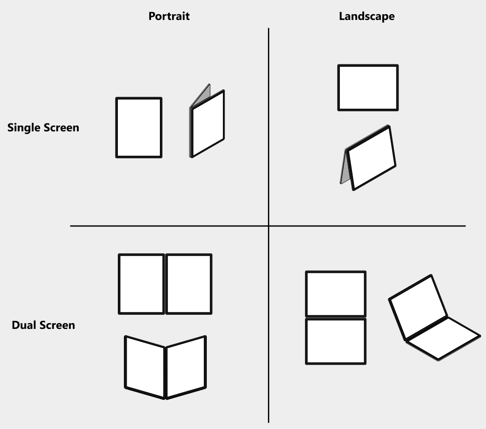

# WindowState - Surface Duo Compose SDK

**WindowState** is a component for Jetpack Compose that helps you easily get details about the window state of the dual-screen, foldable and large screen devices, using the Google [Jetpack WindowManager](https://developer.android.com/jetpack/androidx/releases/window) library.

The component provides the current window information as a Compose state, including folding position, orientation and window size classes. For dual-screen and foldable devices, combining different folding positions and orientations, we introduce four display postures to take advantage of these new form factors: Dual Portrait, Dual Landscape, Single Portrait, Single Landscape.



And the window size classes are measured based on Google [Window size classes](https://developer.android.com/guide/topics/large-screens/support-different-screen-sizes#window_size_classes) to help you support different screen sizes of the devices, including large screen and regular single screen devices.

```kotlin
@Composable
fun Activity.rememberWindowState(): WindowState
```
An interface to provide all the relevant info about the device window.

```kotlin
val foldablePaneWidth: Int
```
Returns a pixel value of the width of a single pane of the dual-screen or foldable device when the device is in the dual-screen mode. If the device is in the single screen mode, or the device is a regular single screen device, the return value will be 0.

```kotlin
val foldSize: Int
```
Returns a pixel value of the width of the hinge of dual-screen device or the folding line of foldable device when the device is in the dual-screen mode. If the device is in the single screen mode, or the device is a regular single screen device, the return value will be 0.

```kotlin
val windowMode: WindowMode
```
Returns the display posture of the window mode: **SINGLE_PORTRAIT**, **SINGLE_LANDSCAPE**, **DUAL_PORTRAIT**, **DUAL_LANDSCAPE**.

```kotlin
@Composable
fun isDualScreen(): Boolean
```
Check if the device window is in the dual screen mode, we called it **spanned** for the dual-screen device or **unfolded** for the foldable device.

```kotlin
@Composable
fun isDualPortrait(): Boolean
```
Check if the device window is in the dual portrait posture, with which the hinge or folding line is vertical.

```kotlin
@Composable
fun isDualLandscape(): Boolean
```
Check if the device window is in the dual portrait posture, with which the hinge or folding line is horizontal.

```kotlin
@Composable
fun isSinglePortrait(): Boolean
```
Check if the device window is in the single portrait posture, with which the device is in the single screen mode or the device is a single screen device with the portrait orientation.

```kotlin
@Composable
fun isSingleLandscape(): Boolean
```
Check if the device window is in the single landscape posture, with which the device is in the single screen mode or the device is a single screen device with the landscape orientation.

```kotlin
@Composable
fun widthSizeClass(): WindowSizeClass
```
Returns the width window size class: **Compact**, **Medium**, **Expanded**, based on the width of the window.

```kotlin
@Composable
fun heightSizeClass(): WindowSizeClass
```
Returns the height window size class: **Compact**, **Medium**, **Expanded**, based on the height of the window.

## Add to your project

1. Make sure you have **mavenCentral()** repository in your top level **build.gradle** file:

    ```gradle
    allprojects {
        repositories {
            google()
            mavenCentral()
         }
    }
    ```

2. Add dependencies to the module-level **build.gradle** file (current version may be different from what's shown here).

    ```gradle
    implementation "com.microsoft.device.dualscreen:windowstate:1.0.0-alpha1"
    ```

3. Also ensure the compileSdkVersion and targetSdkVersion are set to API 31 or newer in the module-level build.gradle file.

    ```gradle
    android { 
        compileSdkVersion 31
        
        defaultConfig { 
            targetSdkVersion 31
        } 
        ... 
    }
    ```

4. Access the info about the window state from **WindowState** to build or adjust your UI. Please refer to the [sample](https://github.com/microsoft/surface-duo-compose-sdk/tree/main/WindowState/sample) for more details.

## Contributing

This project welcomes contributions and suggestions.  Most contributions require you to agree to a
Contributor License Agreement (CLA) declaring that you have the right to, and actually do, grant us
the rights to use your contribution. For details, visit https://cla.opensource.microsoft.com.

When you submit a pull request, a CLA bot will automatically determine whether you need to provide
a CLA and decorate the PR appropriately (e.g., status check, comment). Simply follow the instructions
provided by the bot. You will only need to do this once across all repos using our CLA.

This project has adopted the [Microsoft Open Source Code of Conduct](https://opensource.microsoft.com/codeofconduct/).
For more information see the [Code of Conduct FAQ](https://opensource.microsoft.com/codeofconduct/faq/) or
contact [opencode@microsoft.com](mailto:opencode@microsoft.com) with any additional questions or comments.

## License

Copyright (c) Microsoft Corporation.

MIT License

Permission is hereby granted, free of charge, to any person obtaining a copy of this software and associated documentation files (the "Software"), to deal in the Software without restriction, including without limitation the rights to use, copy, modify, merge, publish, distribute, sublicense, and/or sell copies of the Software, and to permit persons to whom the Software is furnished to do so, subject to the following conditions:

The above copyright notice and this permission notice shall be included in all copies or substantial portions of the Software.

THE SOFTWARE IS PROVIDED AS IS, WITHOUT WARRANTY OF ANY KIND, EXPRESS OR IMPLIED, INCLUDING BUT NOT LIMITED TO THE WARRANTIES OF MERCHANTABILITY, FITNESS FOR A PARTICULAR PURPOSE AND NONINFRINGEMENT. IN NO EVENT SHALL THE AUTHORS OR COPYRIGHT HOLDERS BE LIABLE FOR ANY CLAIM, DAMAGES OR OTHER LIABILITY, WHETHER IN AN ACTION OF CONTRACT, TORT OR OTHERWISE, ARISING FROM, OUT OF OR IN CONNECTION WITH THE SOFTWARE OR THE USE OR OTHER DEALINGS IN THE SOFTWARE.
